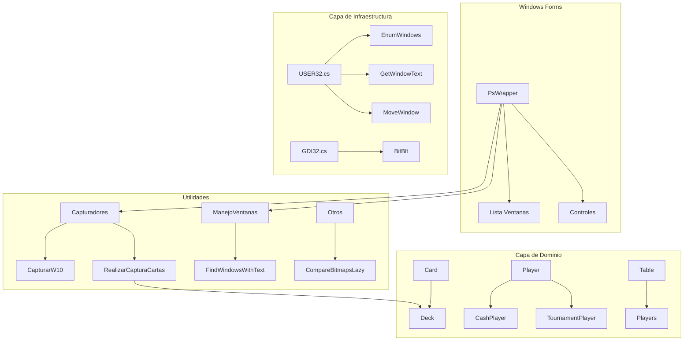

# PStarsWrapper


---

## Descripcion

**PStarsWrapper** es una aplicacion de escritorio Windows Forms que automatiza la captura y reconocimiento de cartas de poker desde ventanas de PokerStars. Mediante tecnicas de screen scraping y comparacion de imagenes, extrae informacion de juego en tiempo real para su procesamiento.

---

## Caracteristicas Principales

- **Deteccion de ventanas**: Enumera y filtra ventanas de juego activas por titulo
- **Captura de pantalla**: Screen scraping con ajuste de bordes para Windows 10
- **Reconocimiento de cartas**: Comparacion de bitmaps para identificar cartas hole cards
- **Gestion de mesas**: Redimensionamiento y posicionamiento de ventanas de juego
- **Modelado de dominio**: Entidades para jugadores, mesas, baraja y posiciones
- **Soporte multi-formato**: Compatible con juegos Cash y Tournament

---

## Stack Tecnologico

| Categoria | Tecnologia |
|-----------|------------|
| Lenguaje | C# |
| Framework | .NET Framework 4.8 |
| UI | Windows Forms |
| Interoperabilidad | P/Invoke (User32.dll, GDI32.dll) |
| Procesamiento de imagen | System.Drawing |
| IDE | Visual Studio 2017+ |

---

## Decisiones Tecnicas / Arquitectura

El proyecto implementa un patron de **Domain-Driven Design** simplificado, separando las entidades de negocio (`Card`, `Deck`, `Player`, `Table`) de la logica de infraestructura. 

La eleccion de **P/Invoke** con User32/GDI32 permite interactuar directamente con el sistema de ventanas de Windows, necesario para aplicaciones externas como PokerStars que no exponen APIs publicas. El uso de **partial classes** en `Util` modulariza responsabilidades (captura, gestion de ventanas, utilidades) manteniendo una interfaz unificada.

La comparacion de cartas mediante **pixel-by-pixel matching** asegura precision determinista sin dependencias de ML/OCR, optimizado para las dimensiones fijas de las cartas en PokerStars.

---

## Diagrama de Arquitectura



---

## Guia de Instalacion

### Requisitos Previos

- Windows 10+ 
- .NET Framework 4.8
- Visual Studio 2017 o superior

### Pasos de Instalacion

```bash
# 1. Clonar el repositorio
git clone https://github.com/samuelhm/PStarsWrapper.git

# 2. Navegar al directorio
cd PStarsWrapper

# 3. Abrir la solucion en Visual Studio
start PStarsWrapper.sln

# 4. Compilar y ejecutar (Ctrl+F5)
```

### Compilacion por linea de comandos

```bash
# Restaurar y compilar
msbuild PStarsWrapper.csproj /p:Configuration=Release

# Ejecutar
.\bin\Release\PStarsWrapper.exe
```

---

## Estructura del Proyecto

```
PStarsWrapper/
├── Entidades/          # Modelos de dominio
│   ├── Card.cs         # Entidad carta con bitmap
│   ├── Deck.cs         # Baraja de 52 cartas
│   ├── Player.cs      # Clase abstracta jugador
│   ├── CashPlayer.cs   # Jugador cash
│   ├── TournamentPlayer.cs
│   ├── Table.cs        # Mesa de juego
│   └── ...
├── Forms/              # WinForms UI
│   ├── PsWrapper.cs    # Formulario principal
│   └── VistaImagen.cs  # Visor de imagenes
├── Util/               # Logica auxiliar
│   ├── Capturadores.cs # Screen capture
│   ├── ManejoVentanas.cs # Window management
│   └── Otros.cs        # Utilidades varias
├── Externo/            # P/Invoke wrappers
│   ├── USER32.cs       # Windows user32.dll
│   └── GDI32.cs        # Windows gdi32.dll
└── Resources/          # Bitmaps de cartas (52 cartas)
```

---

## Contacto

| Plataforma | Enlace |
|------------|--------|
| GitHub | [github.com/samuelhm](https://github.com/samuelhm/) |
| LinkedIn | [linkedin.com/in/shurtado-m](https://www.linkedin.com/in/shurtado-m/) |

---

## Notas

Este proyecto fue desarrollado con fines educativos para demostrar tecnicas de interoperabilidad con Windows API y procesamiento de imagenes en C#.